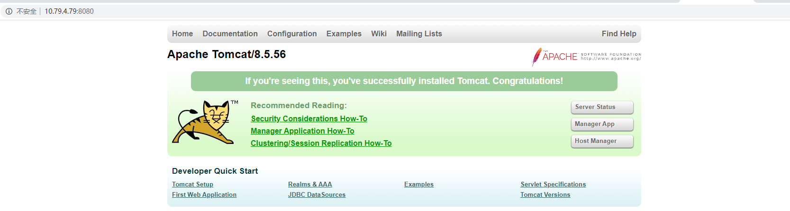

# Nginx反向代理配置与测试

1. 测试服务器10.79.4.79上部署tomcat，并运行

2. 在tomcat的apache-tomcat-8.5.24\webapps\ROOT目录下新建test.jsp文件 
```
<%--
Licensed to the Apache Software Foundation (ASF) under one or more
contributor license agreements.  See the NOTICE file distributed with
this work for additional information regarding copyright ownership.
The ASF licenses this file to You under the Apache License, Version 2.0
(the "License"); you may not use this file except in compliance with
the License.  You may obtain a copy of the License at

    http://www.apache.org/licenses/LICENSE-2.0

Unless required by applicable law or agreed to in writing, software
distributed under the License is distributed on an "AS IS" BASIS,
WITHOUT WARRANTIES OR CONDITIONS OF ANY KIND, either express or implied.
See the License for the specific language governing permissions and
limitations under the License.
--%>
<%@ page session="false" pageEncoding="UTF-8" contentType="text/html; charset=UTF-8" %>
<%
java.text.SimpleDateFormat sdf = new java.text.SimpleDateFormat("yyyy");
request.setAttribute("year", sdf.format(new java.util.Date()));
request.setAttribute("tomcatUrl", "https://tomcat.apache.org/");
request.setAttribute("tomcatDocUrl", "/docs/");
request.setAttribute("tomcatExamplesUrl", "/examples/");
%>
<!DOCTYPE html>
<html lang="en">
    <head>        
    	<meta charset="UTF-8" />        
    	<title><%=request.getServletContext().getServerInfo() %></title>        
    	<link href="favicon.ico" rel="icon" type="image/x-icon" />        
    	<link href="favicon.ico" rel="shortcut icon" type="image/x-icon" />        
    	<link href="tomcat.css" rel="stylesheet" type="text/css" />    
    </head>     
    <body>        
    	<div id="wrapper">            
    		<div id="navigation" class="curved container">		
    			<span id="nav-home">The remote server IP is:<%=request.getHeader("X-real-ip")%></span>		
    			<br/>                
    			<span id="nav-home">The nginx server IP is:<%=request.getRemoteAddr() %></span>                                
    			<br class="separator" />            
    			<span id="nav-home">The remote server IP is:<%=request.getHeader("Host")%></span>		
    			<br/>                
    		</div>        
    	</div>    
    </body> 
</html>
```
3. 修改nginx配置文件，增加location配置并保存
```
[root@svc-app-t28 ROOT]# vi /usr/local/nginx-1.18.0/nginx/conf/nginx.conf
        location ~ \.jsp$ {
            proxy_pass   http://10.79.4.79:8080;
            proxy_set_header X-real-ip $remote_addr;
            proxy_set_header Host $host;
            proxy_set_header X-Forwarded-For $proxy_add_x_forwarded_for;
        }
```
4. 重新加载配置文件
>[root@svc-app-t28 ROOT]# /usr/local/nginx-1.18.0/nginx/sbin/nginx -s reload
5. 分别在nginx服务器和tomcat服务器访问
- nginx服务器访问
```
[root@svc-app-t28 ROOT]# curl http://10.79.4.77/test.jsp
<!DOCTYPE html>
<html lang="en">
    <head>        
        <meta charset="UTF-8" />        
        <title>Apache Tomcat/8.5.56</title>        
        <link href="favicon.ico" rel="icon" type="image/x-icon" />        
        <link href="favicon.ico" rel="shortcut icon" type="image/x-icon" />        
        <link href="tomcat.css" rel="stylesheet" type="text/css" />    
    </head>     
    <body>        
        <div id="wrapper">            
                <div id="navigation" class="curved container">
                        <span id="nav-home">The remote server IP is:10.79.4.77</span>
                        <br/>                
                        <span id="nav-home">The nginx server IP is:10.79.4.77</span>                                
                        <br class="separator" />            
                        <span id="nav-home">The remote server IP is:10.79.4.77</span>
                        <br/>
                </div>        
        </div>    
    </body> 
</html>
```
- tomcat服务器访问
```
[root@svc-app-t30 ROOT]# curl http://10.79.4.77/test.jsp
<!DOCTYPE html>
<html lang="en">
    <head>        
        <meta charset="UTF-8" />        
        <title>Apache Tomcat/8.5.56</title>        
        <link href="favicon.ico" rel="icon" type="image/x-icon" />        
        <link href="favicon.ico" rel="shortcut icon" type="image/x-icon" />        
        <link href="tomcat.css" rel="stylesheet" type="text/css" />    
    </head>     
    <body>        
        <div id="wrapper">            
                <div id="navigation" class="curved container">
                        <span id="nav-home">The remote server IP is:10.79.4.79</span>
                        <br/>                
                        <span id="nav-home">The nginx server IP is:10.79.4.77</span>                                
                        <br class="separator" />            
                        <span id="nav-home">The remote server IP is:10.79.4.77</span>
                        <br/>
                </div>        
        </div>    
    </body> 
</html>
```
6. 总结
>The remote server IP即$remote_addr是客户端IP；
><br/>The nginx server IP即getRemoteAddr()是nginx服务器IP；
><br/>$host是nginx服务器IP。
><br/>反向代理的作用是隐藏服务端的IP，经nginx转发，服务端获取到的远程IP始终是nginx服务器的IP地址。但是仍然可以通过上面设置自定义变量的方式，获取到实际客户端的IP地址。
